# 📱 Sales Inventory - Enterprise Mobile POS & Field Distribution

<div align="center">


**Aplikasi Point of Sales (POS) & Manajemen Distribusi Sales Lapangan Multi-Branch**  
*Mendukung mobilitas tim sales, pemantauan stok real-time, pencatatan outlet berbasis GPS, hingga cetak struk nota langsung di lapangan via Bluetooth Thermal Printer.*

</div>

---

## 📌 Tentang Aplikasi

**Sales Inventory Mobile POS** adalah solusi terpadu yang dirancang khusus untuk memfasilitasi operasional sales lapangan (*field sales*) dalam mendistribusikan produk voucher telekomunikasi/digital ke jaringan outlet atau mitra toko.

Aplikasi ini mengintegrasikan seluruh alur kerja penjualan lapangan: mulai dari katalogisasi produk dan transparansi margin laba, pencatatan outlet mitra dengan koordinat GPS otomatis, transaksi POS cepat, hingga pencetakan bukti transaksi fisik menggunakan printer kasir thermal portable secara langsung di tempat pelanggan.

---

## ✨ Fitur-Fitur Utama

### 1. 📊 Dashboard Bisnis & Analitik Real-Time
* **Ringkasan Penjualan**: Menampilkan total omzet dan perolehan laba kotor secara harian, mingguan, dan bulanan.
* **Grafik Interaktif**: Visualisasi perbandingan penjualan dan laba bersih secara visual menggunakan *Syncfusion Flutter Charts*.
* **Akses Cepat**: Tombol navigasi cepat ke menu Produk, Outlet, Transaksi, dan Akun.

### 2. 📦 Katalog Produk & Manajemen Margin Keuntungan
* **Katalog Berbasis Kategori**: Filter instan berdasarkan provider (*Telkomsel, Indosat, XL, Tri, Smartfren*) dan besaran kuota data.
* **Informasi Margin Transparan**: Halaman detail produk menampilkan **Harga Modal**, **Harga Jual**, persentase margin keuntungan (+50%), serta ketersediaan stok fisik di tangan sales.
* **Alur Retur Cabang**: Opsi pengembalian barang langsung dari halaman detail produk jika terjadi pembatalan atau penyesuaian stok.

### 3. 🏪 Manajemen Outlet Mitra & Deteksi GPS
* **Database Outlet Mitra**: Daftar outlet toko binaan sales lengkap dengan ID Outlet unik, nama pemilik, nomor kontak, dan alamat operasional.
* **Geotagging Otomatis**: Input outlet baru otomatis mendeteksi dan mengunci koordinat GPS perangkat sales (*latitude* & *longitude*), memastikan keakuratan validasi lokasi kunjungan toko.

### 4. 🧾 Transaksi POS & Riwayat Penjualan
* **Keranjang Belanja Fleksibel**: Pemilihan produk cepat, penyesuaian kuantitas, dan kalkulasi subtotal instan.
* **Riwayat Transaksi Terperinci**: Pencatatan riwayat transaksi penjualan per outlet lengkap dengan status pembayaran, rincian barang, dan akumulasi profit yang diperoleh.
* **Pratinjau Nota Digital**: Tampilan struk digital siap cetak sebelum diteruskan ke printer fisik.

### 5. 🖨️ Cetak Struk Nota via Bluetooth Thermal Printer
* **Dukungan Hardware Portabel**: Integrasi dengan berbagai printer kasir Bluetooth thermal 58mm (seperti RPP02, EPPOS, dsb.) menggunakan ESC/POS protocol.
* **Pindai & Hubungkan**: Deteksi perangkat Bluetooth di sekitar, penyimpanan MAC address printer favorit, dan opsi putus koneksi.
* **Uji Coba Cetak (Test Print)**: Fitur cetak sampel struk untuk memverifikasi kesiapan kertas dan koneksi printer sebelum bertransaksi.

### 6. 🔄 Audit Distribusi & Mutasi Stok Multi-Branch
* **Pelacakan Aliran Stok**: Rekap mutasi stok masuk (barang yang diterima dari cabang penugasan) dan stok retur keluar secara berkala beserta timestamp akurat.
* **Multi-Branch Session**: Sales beroperasi di bawah cabang penugasan resmi (contoh: Cabang Jakarta) yang dikelola terpusat dari admin.

---

## 📸 Tangkapan Layar Aplikasi (Screenshots)

### 🚀 Alur Autentikasi & Dashboard Utama
| Halaman Login POS | Dashboard & Ringkasan | Analitik Penjualan & Laba |
| :---: | :---: | :---: |
| 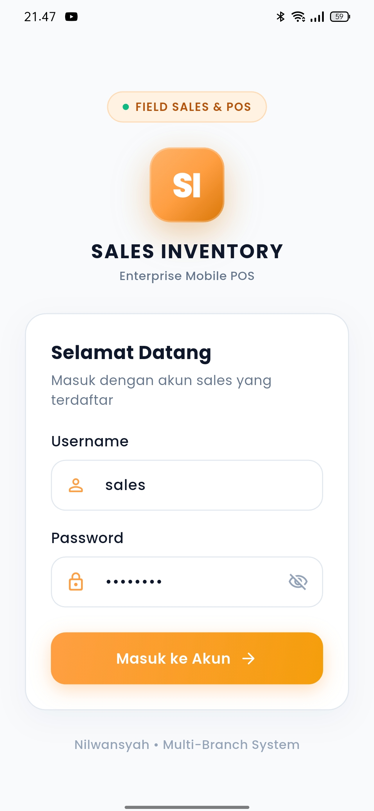 | 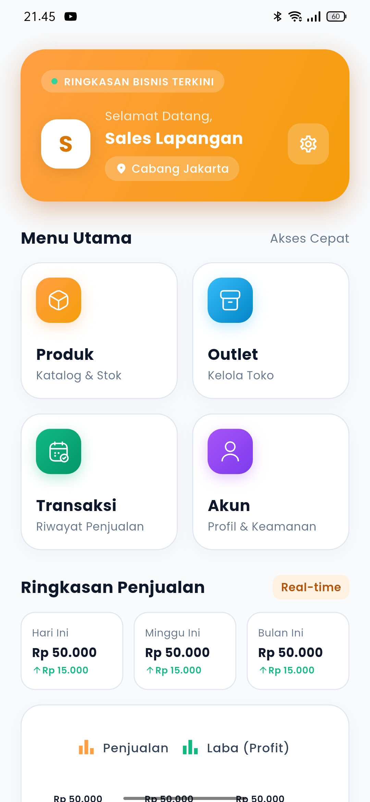 | 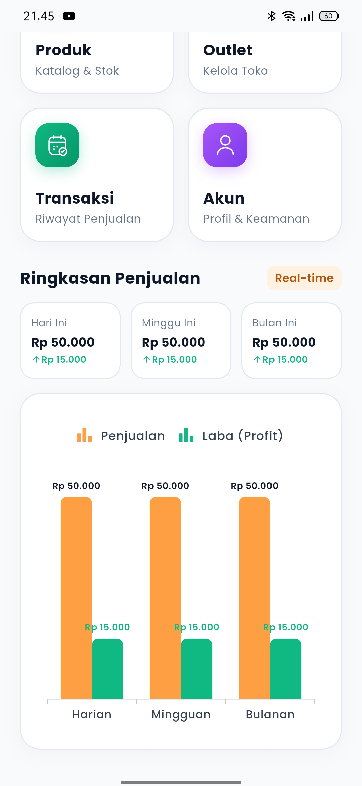 |
| *Login multi-branch sales lapangan* | *Menu utama & ringkasan penjualan harian* | *Grafik performa penjualan vs margin laba* |

---

### 📦 Manajemen Katalog & Detail Produk
| Katalog Produk & Kuota | Detail Produk & Kalkulasi Margin |
| :---: | :---: |
| 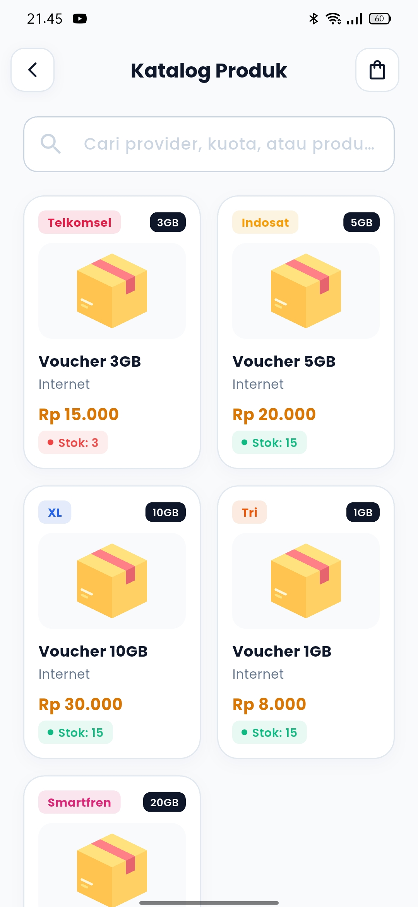 | 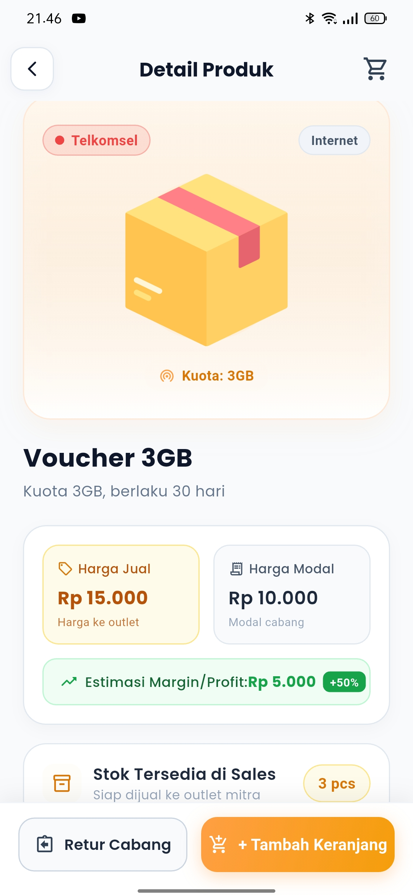 |
| *Pencarian produk, provider, kuota, & stok* | *Analisis margin, harga modal, & retur cabang* |

---

### 🏪 Manajemen Toko Mitra & Lokasi GPS
| Daftar Outlet Mitra | Tambah Outlet Baru (Auto GPS) |
| :---: | :---: |
| 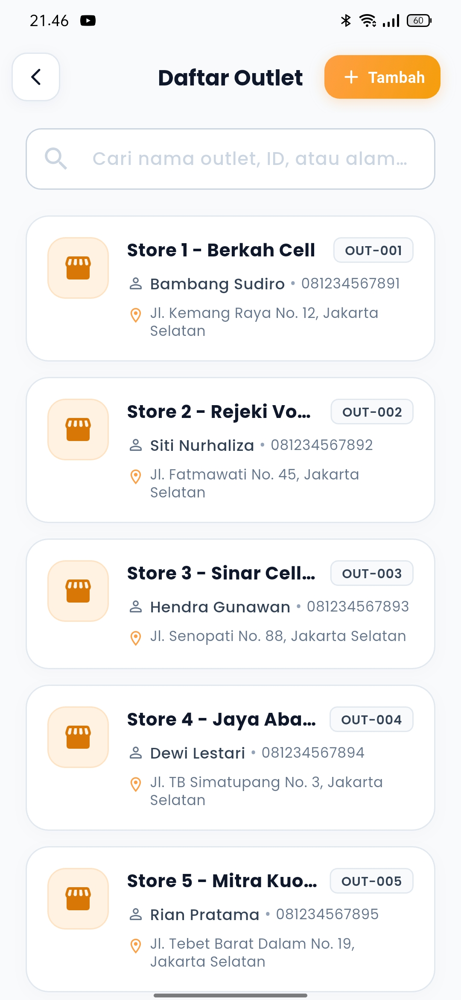 | 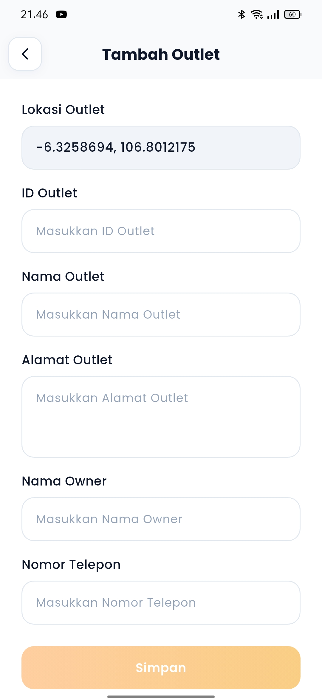 |
| *Direktori outlet toko dan data pemilik* | *Pencatatan koordinat GPS otomatis saat input* |

---

### 💳 Transaksi, Pratinjau Struk, & Cetak Fisik
| Riwayat Transaksi | Pratinjau Struk Digital | Bukti Cetak Thermal Printer |
| :---: | :---: | :---: |
| 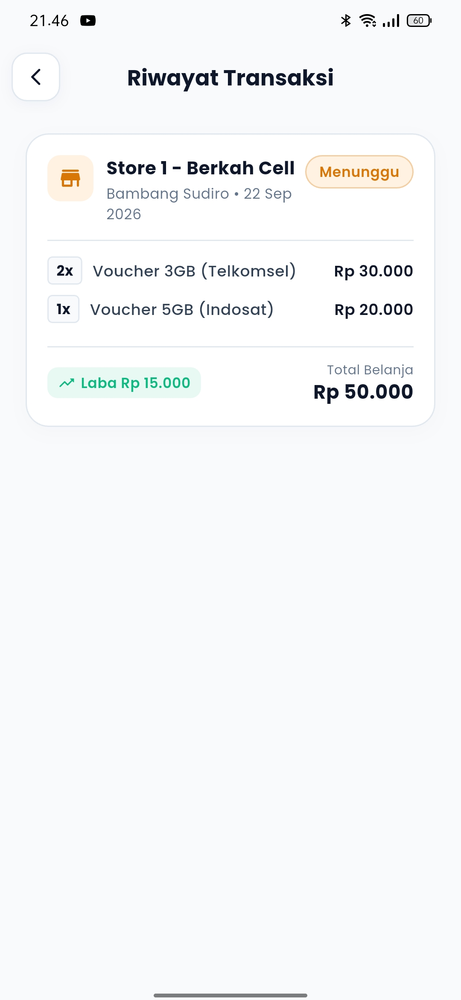 | 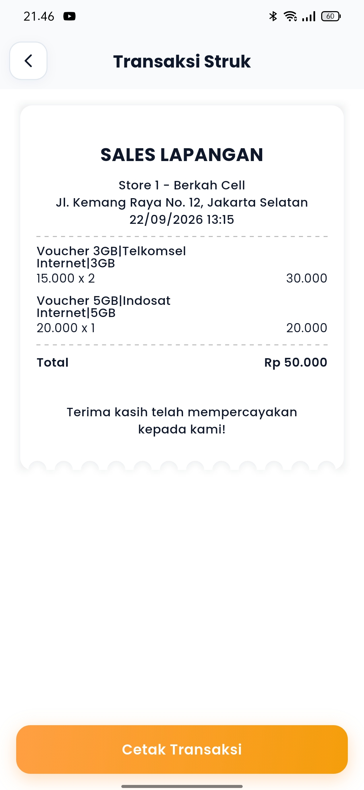 | 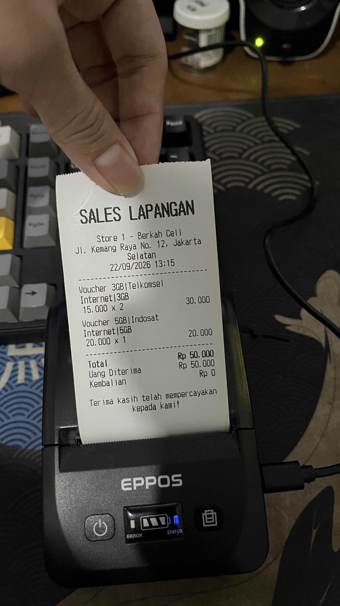 |
| *Daftar transaksi per toko & laba transaksi* | *Tampilan struk digital siap print* | *Hasil cetak fisik nyata via printer Bluetooth EPPOS* |

---

### ⚙️ Pengaturan Hardware & Distribusi Stok
| Konfigurasi Bluetooth Printer | Riwayat Mutasi Stok Cabang | Akun & Profil Sales |
| :---: | :---: | :---: |
| 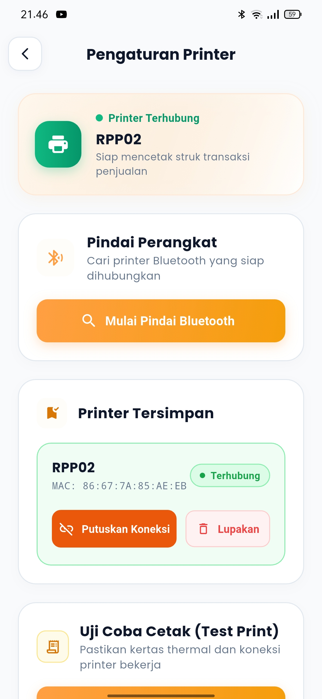 | 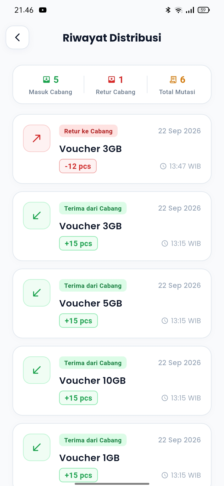 | 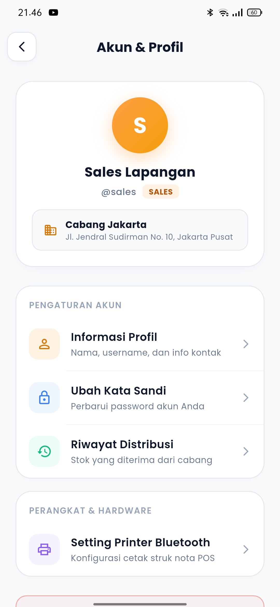 |
| *Scanning, koneksi MAC address, & test print* | *Audit penerimaan stok dan retur cabang* | *Informasi cabang penugasan & keamanan akun* |

---

## 🛠️ Arsitektur & Teknologi

Aplikasi dibangun menggunakan pola arsitektur **MVVM (Model-View-ViewModel)** dengan pemisahan tanggung jawab yang jelas:

```
sales_app/
├── android/                 # Konfigurasi native Android (Bluetooth & Location permissions)
├── ios/                     # Konfigurasi native iOS
├── docs/                    # Dokumentasi & aset gambar
│   └── images/              # Tangkapan layar fitur-fitur aplikasi
├── lib/
│   ├── core/                # Lapisan inti aplikasi
│   │   ├── api/             # Retrofit REST API interface (auth, outlet, product, etc.)
│   │   ├── config/          # Konfigurasi environment (AppConfig)
│   │   ├── models/          # Data model transfer objects (DTO)
│   │   ├── services/        # Service networking (DioService) & storage (PrefService)
│   │   └── utils/           # Helper format mata uang, tanggal, dsb.
│   ├── features/            # Fitur berbasis modular
│   │   ├── auth/            # Splash screen & Login
│   │   ├── cart/            # Keranjang pesanan
│   │   ├── checkout/        # Proses checkout pesanan
│   │   ├── home/            # Dashboard & grafik ringkasan bisnis
│   │   ├── outlet/          # Manajemen outlet & tambah outlet GPS
│   │   ├── product/         # Katalog & detail produk
│   │   ├── profile/         # Profil, mutasi distribusi, setting printer
│   │   └── transaction/     # Riwayat transaksi & struk pembayaran
│   ├── ui/                  # Sistem desain UI terpusat
│   │   ├── shared/          # Reusable custom buttons, inputs, cards
│   │   └── theme/           # AppColors, AppFonts, & tema aplikasi
│   ├── main.dart            # Entry point aplikasi Flutter
│   └── provider_setup.dart  # Registrasi MultiProvider (Services & ViewModels)
└── pubspec.yaml             # Manajemen dependensi pustaka
```

### Pustaka & Komponen Utama:
* **State Management**: [`provider`](https://pub.dev/packages/provider) (MVVM dengan `BaseViewModel` dan `BaseView`).
* **HTTP Client & REST API**: [`dio`](https://pub.dev/packages/dio), [`retrofit`](https://pub.dev/packages/retrofit), [`pretty_dio_logger`](https://pub.dev/packages/pretty_dio_logger).
* **Thermal Printing**: [`print_bluetooth_thermal`](https://pub.dev/packages/print_bluetooth_thermal), [`esc_pos_utils_plus`](https://pub.dev/packages/esc_pos_utils_plus).
* **Location & Geotagging**: [`geolocator`](https://pub.dev/packages/geolocator), [`permission_handler`](https://pub.dev/packages/permission_handler).
* **Data Visualization**: [`syncfusion_flutter_charts`](https://pub.dev/packages/syncfusion_flutter_charts).
* **UI & Aesthetics**: [`shimmer`](https://pub.dev/packages/shimmer), [`flutter_svg`](https://pub.dev/packages/flutter_svg), [`google_fonts`](https://pub.dev/packages/google_fonts).
* **Security & Storage**: [`shared_preferences`](https://pub.dev/packages/shared_preferences), [`flutter_dotenv`](https://pub.dev/packages/flutter_dotenv).

---

## 🚀 Petunjuk Menjalankan Proyek

### 1. Prasyarat Sistem
* [Flutter SDK](https://docs.flutter.dev/get-started/install) (versi 3.7.2 atau lebih baru)
* Dart SDK (sesuai target SDK di Flutter)
* Android Studio / VS Code dengan plugin Flutter & Dart
* Perangkat fisik Android (disarankan untuk menguji fitur Bluetooth Thermal Printer & GPS)

### 2. Langkah Instalasi

1. **Clone repository ini**:
   ```bash
   git clone https://github.com/username/sales_app.git
   cd sales_app
   ```

2. **Salin file konfigurasi environment**:
   ```bash
   copy .env.example .env
   ```
   *Buka file `.env` lalu sesuaikan endpoint backend:*
   ```env
   API_URL=https://api.yourdomain.com/api/v1
   ```

3. **Unduh dependensi project**:
   ```bash
   flutter pub get
   ```

4. **Jalankan Code Generation (jika memperbarui API/Model)**:
   ```bash
   dart run build_runner build --delete-conflicting-outputs
   ```

5. **Jalankan aplikasi di perangkat / emulator**:
   ```bash
   flutter run
   ```

---

## 🖨️ Panduan Integrasi Printer Thermal Bluetooth

1. Aktifkan koneksi **Bluetooth** dan izin **Lokasi / Nearby Devices** pada smartphone Anda.
2. Nyalakan perangkat printer thermal portable (contoh: *RPP02 / EPPOS*).
3. Buka aplikasi **Sales Inventory** > Masuk ke menu **Akun** > Pilih **Setting Printer Bluetooth**.
4. Tekan tombol **Mulai Pindai Bluetooth** untuk mendeteksi perangkat.
5. Pilih perangkat printer dari daftar yang ditemukan untuk melakukan pairing.
6. Tekan tombol **Cetak Sample Struk Penjualan** untuk memverifikasi bahwa printer telah terhubung dan mencetak dengan normal.
7. Printer kini siap digunakan untuk mencetak struk di setiap transaksi penjualan lapangan!

---

## 📄 Hak Cipta & Lisensi

Dikembangkan sebagai bagian dari **Nilwansyah Multi-Branch System**. Seluruh hak cipta dilindungi. Penggunaan dan distribusi kode tunduk pada kebijakan internal tim pengembang.
